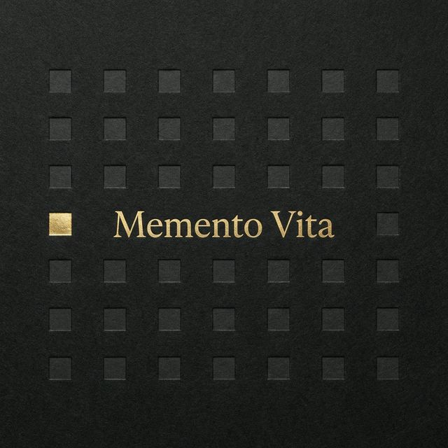

# Memento Vita

**Your life, in weeks.**

I turned 25 and did some math. At a global average life expectancy of 73 years, I've already used up about 34% of my weeks. That number just sat with me. So I built this — a way to actually *see* it. Not to be morbid, but to be honest. And once I had it, I figured maybe other people would want to stare at their own mortality too.

This is a life visualization tool. You tell it when you were born and how you spend your days, and it shows you what's left — as a grid of weeks, months, or years. Each cell is a unit of your life: lived, current, or yet to come.

---

## What It Does

- **Life Grid** — Your entire life as a grid. Weeks (4,000ish tiny boxes), months, or years. The filled ones are behind you. The empty ones are what you have left. One of them is glowing — that's right now.
- **Time Breakdown** — You sleep 8 hours a day? That's a third of your remaining life. Work 8 more? There goes another third. The app does the math on where your time actually goes.
- **Reality Checks** — How many times will you visit your parents? How many summers are left? How many books could you still read? These aren't meant to depress you. They're meant to make you *choose*.
- **Dark & Light Mode** — Because sometimes you want to confront your mortality in a well-lit room.
- **Everything stays on your device.** No accounts, no servers, no tracking. Your data lives in your browser's localStorage and nowhere else.

## Getting Started

```bash
git clone https://github.com/RumiAllbert/memento-vita.git
cd memento-vita
npm install
npm run dev
```

Open [localhost:4321](http://localhost:4321). The onboarding takes about a minute.

## The Onboarding

You walk through 5 quick steps:

1. **You** — Name, birthday, life expectancy
2. **Retirement** — When you plan to stop working
3. **Relationships** — Your parents' age, how often you see them
4. **Screen time** — How many hours a day you're on your phone (brace yourself)
5. **Daily time** — How you split your 24 hours across sleep, work, family, hobbies, etc.

No signup. No email. No nonsense.

## How the Math Works

The core idea is simple:

- Your life = `life_expectancy × 52` weeks
- Weeks lived = days since your birthday ÷ 7
- For each daily activity: `(hours / 24) × weeks_remaining` = your remaining life spent on that thing
- Work stops counting at your retirement age. Everything else continues until the end.
- Parent visits remaining = `(parent_life_expectancy - parent_current_age) × visits_per_year`

The insight stats — books left to read, full moons to see, Christmases remaining — are derived from your remaining weeks using reasonable averages. They hit different when they're *your* numbers.

## Tech Stack

| | |
|---|---|
| **Framework** | [Astro](https://astro.build) + [React](https://react.dev) |
| **Styling** | [Tailwind CSS](https://tailwindcss.com) v4 |
| **Animations** | [Framer Motion](https://www.framer.com/motion/) |
| **State** | [Nanostores](https://github.com/nanostores/nanostores) with localStorage persistence |
| **Font** | JetBrains Mono |
| **Backend** | None. It's all client-side. |

## Project Structure

```
src/
├── components/          # React components (grid, stats, onboarding)
├── layouts/             # Astro HTML shell
├── lib/
│   ├── calculations.ts  # All the life math
│   └── constants.ts     # Defaults, colors, labels
├── pages/
│   ├── index.astro      # Onboarding
│   └── dashboard.astro  # The main view
├── stores/
│   └── life.ts          # State management
└── styles/
    └── global.css       # Theme system + fonts
```

## Commands

| Command | What it does |
|---|---|
| `npm run dev` | Start dev server at `localhost:4321` |
| `npm run build` | Build for production |
| `npm run preview` | Preview the production build |

## Privacy

Zero data leaves your browser. No analytics, no cookies, no server calls. Clear your browser data and it's gone. That's a feature, not a limitation.

## Why "Memento Vita"

"Memento mori" means "remember you will die." This is the other side — *remember you are alive.* You still have weeks left. Use them.

## Contributing

If this resonated with you and you want to make it better, PRs are welcome. Some ideas:

- [ ] Deploy to a public URL
- [ ] Milestone markers (weddings, graduations, big life goals)
- [ ] Export your grid as an image
- [ ] More insight cards
- [ ] Accessibility improvements
- [ ] Mobile polish

## License

MIT

---

<p align="center">
  <i>The average human life is about 4,000 weeks.<br/>How many do you have left?</i>
</p>
